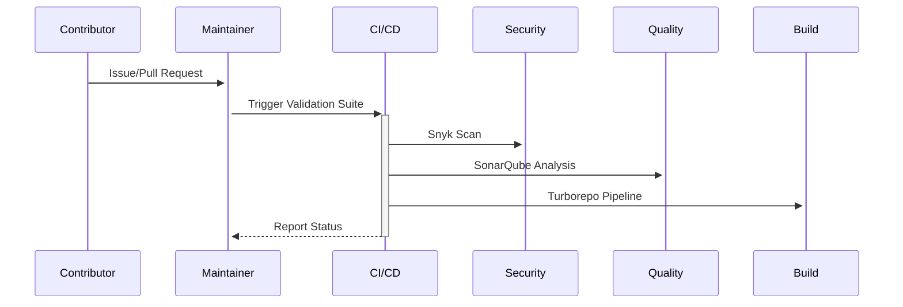

# 🦅 Maval - Professional Web Development Platform

[](https://maval.dev)
[](https://react.dev)
[](https://www.typescriptlang.org/)


Enterprise-grade platform for showcasing technical projects with integrated 3D visualization and real-time analytics.

## 🏆 Enterprise Features

<div align="center">

| **Architecture**       | **Experience**         | **Performance**      |
|------------------------|-------------------------|-----------------------|
| ✅ Optimized SSR       | ✅ AI Theme System     | 🚀 95+ Lighthouse    |
| 🌐 Microfrontend Ready | 🎮 WebGL 3D Controls   | 🔥 Lazy Loading + CDN |
| 🛡 Auth0 Integration   | 📊 Interactive Dashboards | ⚡ Vite Turbo Mode   |
| 🔗 GraphQL Federation  | 🌍 Multi-language Support | 🧩 Module Federation |

</div>

## 🛠 Maval Tech Radar 2025

**Core Platform**
```bash
"dependencies": {
  "@react-three/fiber": "^9.0.0",
  "three": "^0.152.0",
  "@auth0/auth0-react": "^2.0.0",
  "apollo-client": "^3.7.0"
}
```

**Developer Ecosystem**
```bash
"devDependencies": {
  "vite": "^5.0.0",
  "typescript": "5.0.4",
  "cypress": "^12.0.0",
  "storybook": "^7.0.0"
}
```

## 🚀 Quick Start

```bash
# Clone with SSH
git clone git@github.com:Jhonyy-Dev/Maval.git && cd Maval

# Clean installation
npm ci --silent

# Start premium dev environment
npm run dev -- --profile --https
```

## 🧩 Project Anatomy

```graphql
Maval/
├── public/            # Static Assets
│   └── glb/           # Certified 3D Models
├── src/
│   ├── core/          # Business Logic
│   ├── engine/        # 3D/WebGL System
│   ├── modules/       # Enterprise Features
│   └── design-system/ # Atomic Design System
```

## 🤝 Contribution Workflow



## 📜 License & Compliance

**Maval Platform** 2025 - [Jhonatan Yokarique](https://github.com/Jhonyy-Dev)
Licensed under [AGPL-3.0](LICENSE) with commercial use clause.

[](https://app.fossa.com/projects/git%2Bgithub.com%2FJhonyy-Dev%2FMaval)

<details>
  <summary> Enterprise Contact</summary>
  
  **CTO**: Jhonatan Yokarique
  [cto@maval.dev](mailto:yokarique1@gmail.com)
  [LinkedIn Enterprise](https://linkedin.com/company/maval-dev)
  [Visit Offices](https://goo.gl/maps/xyz)
</details>

[](https://ngc.nvidia.com)